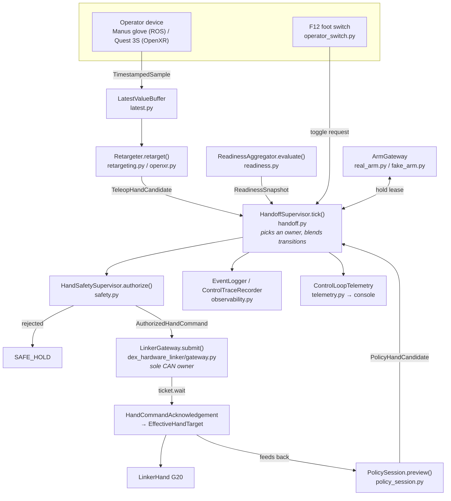
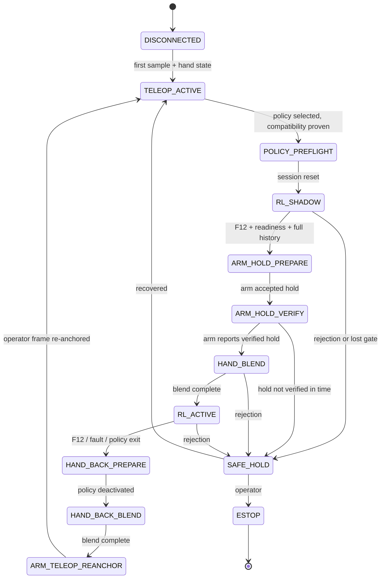

# Architecture

*[English](architecture.md) | [中文](zh/architecture.md)*

How the runtime is put together, and why it is put together that way. Read this
before changing anything; read [onboarding.md](onboarding.md) first if you just
want to get it running.

## What this repository is

A neutral hardware runtime for mixed teleoperation / reinforcement-learning
control of a dexterous hand. It owns:

- the internal contracts every component speaks,
- teleoperation adapters (glove, VR hand tracking) and retargeting,
- policy loading, validation, and inference,
- exclusive hardware gateways,
- the supervisor that arbitrates who is allowed to move the hand,
- observability.

It does **not** train policies, depend on Isaac Lab, or import `dex-forge`
training code. Policies arrive as self-describing packages; see
[interfaces/policy.md](interfaces/policy.md).

## Layering

Four packages, with dependencies flowing strictly downward. This is enforced in
CI by [`.importlinter`](../.importlinter), not merely by convention.

```
                 ┌──────────────────────────────────────┐
                 │            dex_runtime               │
                 │  supervisor, safety, policy, CLI     │
                 └──────────────────────────────────────┘
                        │                      │
          ┌─────────────┘                      └─────────────┐
          ▼                                                  ▼
┌───────────────────────┐                      ┌───────────────────────┐
│  dex_teleop_adapters  │                      │  dex_hardware_linker  │
│  sources, retargeting │                      │  gateway, transport,  │
│                       │                      │  calibration          │
└───────────────────────┘                      └───────────────────────┘
          │                                                  │
          └─────────────────────┐      ┌─────────────────────┘
                                ▼      ▼
                        ┌──────────────────────┐
                        │    dex_contracts     │
                        │  immutable dataclass │
                        │  vocabulary, no deps │
                        └──────────────────────┘
```

The three enforced contracts, and the reason each exists:

| Contract | Why |
|---|---|
| `dex_contracts` may not import the other three | It is the shared vocabulary. If it could reach upward, every consumer would inherit a hardware or ML dependency, and the contracts could no longer be reasoned about in isolation. |
| `dex_teleop_adapters` may not import hardware or runtime | Retargeting is pure geometry. Keeping it hardware-free is what lets it be tested against golden traces with no CAN bus, and what stops device-specific quirks leaking into the control path. |
| `dex_hardware_linker` may not import `dex_runtime` | The gateway must be usable and testable without the supervisor, and the dependency must not become mutual. |

`tools/` sits above all four. It is commissioning and demonstration surface, not
part of the runtime; nothing in `src/` may import it.

## The control path

One tick of the loop, from operator motion to hardware. Everything below happens
in `HandOnlyRuntime.run()` in [`application.py`](../src/dex_runtime/application.py).



Stage by stage:

1. **Source.** The device thread validates handedness, joint layout, and
   per-node validity, then publishes a `TimestampedSample` into a
   `LatestValueBuffer`. Buffers overwrite rather than queue: a late consumer
   should see the newest pose, never a backlog of stale ones.
2. **Retargeting.** Device joints are mapped into the solver's layout, the wrist
   frame is estimated, the solver runs, and the result is projected onto the
   calibration's *named* semantic joints. Output is a `TeleopHandCandidate`.
   Nothing downstream knows which device produced it.
3. **Readiness.** Four providers each emit evidence with a generation time and a
   validity window. See "Readiness is evidence" below.
4. **Arbitration.** `HandoffSupervisor.tick()` selects teleop or policy according
   to its state, interpolating between them during transitions.
5. **Safety.** The chosen candidate is checked against the deployment envelope
   and the session identity, then stamped into an `AuthorizedHandCommand` with an
   owner, an epoch, and a deadline. This is the only way a command is created.
6. **Gateway.** The command is queued to the gateway's own thread, which is the
   only thread that touches the transport. The acknowledgement carries back the
   `EffectiveHandTarget` the hardware is believed to be tracking.
7. **Observability.** State transitions and rejections go to a JSONL event log;
   full per-tick traces go to a rate-limited JSONL trace; a
   `ControlLoopTelemetry` snapshot is published for operator surfaces.

## The handoff state machine



Two properties are worth internalising:

- **Every forward step is gated, every failure goes backward.** There is no path
  that reaches `RL_ACTIVE` without readiness evidence, a full policy history,
  and a verified arm hold. Anything unexpected lands in `SAFE_HOLD`, which holds
  the last safe target, rather than continuing.
- **Transitions are blended, not switched.** `HAND_BLEND` and `HAND_BACK_BLEND`
  interpolate over a configured number of ticks, and every interpolated target
  goes through the full safety check like any other command.

## Design decisions, and why

### Ownership is an epoch, not a flag

Every owner transition increments a `control_epoch`. Candidates, commands, and
acknowledgements all carry it, and the gateway rejects anything whose epoch is
not the current owner's.

The alternative — a boolean "policy has control" — has a race at exactly the
worst moment: a command issued by the previous owner, already in flight when
control changes, arrives and is executed. With epochs that command is simply
rejected. Nothing has to be cancelled, and correctness does not depend on
timing.

### Scheduled time and decision time are separate

Policy observations are indexed by nominal control cadence; command
authorization is judged against the actual clock. See
`HandoffSupervisor.tick()`.

They have to be separate because the hardware round trip is real. If a tick's
authorization used the nominal schedule, a sample that arrived perfectly on time
could look like it came from the future once the CAN round trip pushed the tick
late, and get rejected as invalid. The safety supervisor therefore tolerates
bounded intra-period skew while still rejecting genuinely future-dated data.

### Readiness is evidence, not a flag

There is no central `ready` boolean. Four providers
(`operator-confirmation-v1`, `hand-state-freshness-v1`, `gateway-health-v1`,
`policy-compatibility-v1`) each emit evidence stamped with when it was generated
and how long it stays valid. The aggregator checks, *at decision time*, that
every required provider is present, valid, and passing.

This makes staleness impossible to ignore. A boolean set five seconds ago and a
boolean set five milliseconds ago are indistinguishable; evidence with a
validity window is not. It also means adding a new precondition is adding a
provider, not editing a condition everyone else depends on.

### The policy runs before it is allowed to command

`RL_SHADOW` runs full inference while teleoperation still owns the hand. The
policy fills its observation history and previews targets that are evaluated by
the safety supervisor and recorded — but not sent.

This is what makes activation bumpless. By the time the policy takes over, its
history is full and its first target continues from the target already in
effect, rather than from whatever an uninitialised buffer implies. It also means
a policy that would have violated the envelope is visible in the trace *before*
it is ever given the hand.

### Actions are deltas on acknowledged state

A policy outputs an action in `[-1, 1]`, which is scaled and added to the
current `EffectiveHandTarget` — the target the hardware is believed to be
tracking, per its acknowledgement — not to the last target sent.

If a command is dropped, integrating from "what we sent" would have the policy
compounding its next action onto a position the hand never reached. Integrating
from acknowledged state degrades safely instead.

### Content addressing everywhere

Calibrations, semantic schemas, teleop profiles, and policy packages are all
identified by a digest of their canonical JSON. Compatibility is checked by
comparing digests, not version strings.

A version string says two artifacts claim to be the same. A digest proves it.
Since the consequence of a silently-edited calibration is the hand moving to the
wrong angles, this is the right trade.

## Threading and exclusive ownership

| Resource | Sole owner | Enforcement |
|---|---|---|
| CAN bus / hand | `LinkerGateway`'s internal thread | Only that thread touches the transport; callers hand work over via a queue |
| Hitbot arm | `tools/vr_hitbot_controller.py`, a separate process | `real_arm.py` is a loopback UDP *client*; it never imports the arm SDK |
| D435 camera | `tools/control_console/realsense_worker.py` subprocess | Isolated so a camera stall cannot block the control loop |
| Operator device | The source's own transport thread | Publishes into a `LatestValueBuffer`; the callback does no work |

The consequence worth remembering: the LinkerHand ROS SDK is **never** run
alongside this runtime, and `dex_teleop/main_new.py` is imported for its reader
and transform code but never executed as a second hand owner. One bus, one
owner, always.

## Module reference

### `dex_contracts` — the vocabulary

| Module | Responsibility |
|---|---|
| `identity.py` | `MessageIdentity`, `TimestampedSample`, ownership/command/acknowledgement enums, `PROTOCOL_VERSION` |
| `hand.py` | `HandState`, `HandCandidate` and its teleop/policy subtypes, `AuthorizedHandCommand`, `EffectiveHandTarget` |
| `arm.py` | Arm capability, state, and target contracts |
| `policy.py` | `PolicyDescriptor`, `PolicyCompatibility` |
| `readiness.py` | Readiness evidence, results, requirements, snapshots |
| `serialization.py` | `canonical_json` / `to_primitive`, the basis of every digest |

### `dex_runtime` — supervision and execution

| Module | Responsibility |
|---|---|
| `application.py` | `HandOnlyRuntime`: lifecycle and the main control loop |
| `handoff.py` | The state machine; arbitration, blending, arm-hold sequencing |
| `safety.py` | Envelope and identity checks; the only source of authorized commands |
| `policy_session.py` | Policy lifecycle and inference (`RuntimeActor` + `RuntimeAdapter`) |
| `policy_package.py` | Package validation, digest verification, registry scanning |
| `codecs.py` | Proprioception encoding; no ML, ROS, or hardware dependency |
| `readiness.py` | The aggregator and its four evidence providers |
| `deployment.py` | Strict immutable config loading and validation |
| `preflight.py` | Non-actuating proof that a deployment is coherent |
| `composition.py` | Builds a runtime from a preflight result |
| `cli.py` | `dex-runtime` entrypoint |
| `observability.py` | JSONL events and rate-limited control traces |
| `telemetry.py` | `ControlLoopTelemetry`, `TelemetryHub` for operator surfaces |
| `status.py` | Terminal status renderer |
| `operator_switch.py` | PCsensor F12 foot switch via evdev, with debouncing |
| `real_arm.py` / `fake_arm.py` | Arm hold gateways, real and deterministic |
| `fake_hand.py` | Contract fake for supervisor tests |
| `latest.py` | Bounded latest-value buffer with overwrite accounting |
| `clock.py` | `SystemClock` and `FakeClock` |

### `dex_teleop_adapters` — operator input

| Module | Responsibility |
|---|---|
| `protocols.py` | `TeleopSource` / `Retargeter` structural contracts |
| `manus.py` | Manus glove source (ROS 2), 25-node native layout |
| `openxr.py` | Quest 3S / WiVRn source and retargeter, 26-joint layout |
| `retargeting.py` | Manus DexPilot retargeter |
| `manus_math.py` | Manus → MANO conversion (documented in Chinese) |
| `hand_frame.py` | Wrist frame estimation by SVD plane fit |
| `profiles.py` | Digest-checked teleop profile loading |

### `dex_hardware_linker` — hardware

| Module | Responsibility |
|---|---|
| `gateway.py` | The exclusive, epoch-enforcing CAN owner |
| `transport.py` | `LinkerTransport`, with SDK and fake implementations |
| `calibration.py` | Semantic schema, per-joint calibration, digests |
| `assets/` | Frozen calibrations, semantic schema, URDF, meshes |

## Where to go next

- [onboarding.md](onboarding.md) — get it running, with no hardware
- [interfaces/teleop.md](interfaces/teleop.md) — add an operator device
- [interfaces/policy.md](interfaces/policy.md) — deploy a trained policy
- [interfaces/hardware.md](interfaces/hardware.md) — add a hand or arm
- [tools.md](tools.md) — what every script in `tools/` is for
- [operator-runbook.md](operator-runbook.md) — the authorized operating procedure
