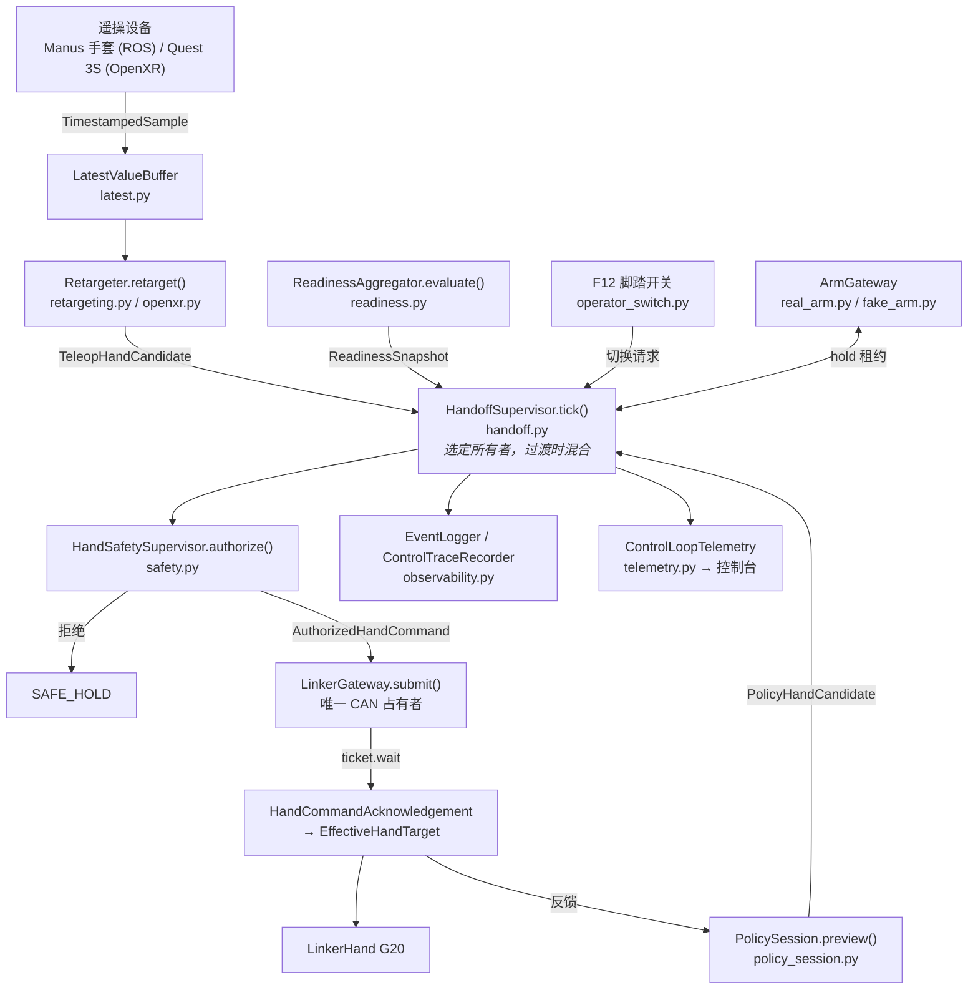
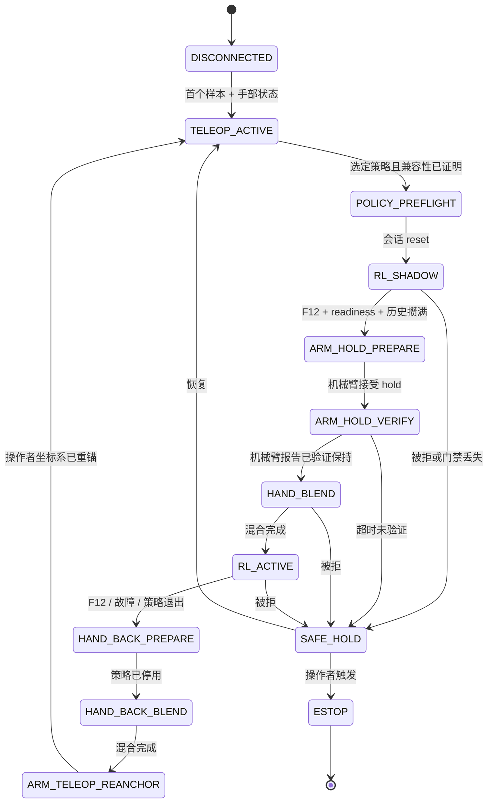

# 架构总览

*[English](../architecture.md) | [中文](architecture.md)*

系统是怎么搭起来的，以及**为什么**这样搭。动手改任何东西之前先读这篇；
如果只是想先跑起来，先看[上手指南](onboarding.md)。

## 这个仓库是什么

灵巧手「遥操 + 强化学习」混合控制的中性硬件运行时。它负责：

- 各组件之间的内部契约，
- 遥操适配（手套、VR 手部追踪）与重定向，
- 策略的加载、校验与推理，
- 独占的硬件网关，
- 决定谁有权移动手的监管器，
- 可观测性。

它**不**训练策略，不依赖 Isaac Lab，也不导入 `dex-forge` 训练代码。
策略以自描述的「策略包」形式进入系统，见[策略接口](interfaces/policy.md)。

## 分层

四个包，依赖严格单向向下。这一点由 CI 通过 [`.importlinter`](../../.importlinter)
强制执行，不只是约定。

```
                 ┌──────────────────────────────────────┐
                 │            dex_runtime               │
                 │   监管器、安全、策略执行、CLI        │
                 └──────────────────────────────────────┘
                        │                      │
          ┌─────────────┘                      └─────────────┐
          ▼                                                  ▼
┌───────────────────────┐                      ┌───────────────────────┐
│  dex_teleop_adapters  │                      │  dex_hardware_linker  │
│  数据源、重定向        │                      │  网关、transport、标定 │
└───────────────────────┘                      └───────────────────────┘
          │                                                  │
          └─────────────────────┐      ┌─────────────────────┘
                                ▼      ▼
                        ┌──────────────────────┐
                        │    dex_contracts     │
                        │  不可变 dataclass    │
                        │  词汇表，零依赖      │
                        └──────────────────────┘
```

三条强制契约，以及每条存在的理由：

| 契约 | 为什么 |
|---|---|
| `dex_contracts` 不得导入其他三个包 | 它是共享词汇表。一旦能向上依赖，所有使用者都会被迫继承硬件或 ML 依赖，契约也就无法被独立推理了。 |
| `dex_teleop_adapters` 不得导入硬件层与运行时 | 重定向是纯几何。保持它无硬件依赖，才能用 golden trace 在没有 CAN 总线的情况下测试，也才能阻止设备特有的怪癖渗进控制链路。 |
| `dex_hardware_linker` 不得导入 `dex_runtime` | 网关必须能脱离监管器被使用和测试，且依赖关系不能变成相互的。 |

`tools/` 位于四层之上。它是调试与演示的外围，不属于运行时；`src/` 下任何代码都不得导入它。

## 控制链路

一个 tick，从操作者动作到硬件。以下全部发生在
[`application.py`](../../src/dex_runtime/application.py) 的 `HandOnlyRuntime.run()` 中。



逐段说明：

1. **数据源。** 设备线程校验左右手、关节布局和逐节点有效性，然后把
   `TimestampedSample` 发布进 `LatestValueBuffer`。缓冲区是覆盖而非排队的：
   慢消费者应该看到最新的姿态，而绝不是一串陈旧姿态的积压。
2. **重定向。** 设备关节被映射到求解器的布局，估计腕部坐标系，运行求解器，
   再把结果投影到标定中**具名**的语义关节上。输出 `TeleopHandCandidate`。
   下游不知道是哪个设备产生的。
3. **Readiness。** 四个 provider 各自产出带生成时间和有效期的证据，见下文
   「readiness 是证据」。
4. **仲裁。** `HandoffSupervisor.tick()` 按当前状态在遥操与策略之间选择，
   过渡期做插值混合。
5. **安全。** 被选中的候选值对照部署包络和会话身份做校验，然后盖章成
   `AuthorizedHandCommand`，带上所有者、epoch 和截止时间。这是命令的唯一产生方式。
6. **网关。** 命令入队到网关自己的线程——唯一接触 transport 的线程。
   确认消息带回硬件正在跟踪的 `EffectiveHandTarget`。
7. **可观测性。** 状态迁移与拒绝写入 JSONL 事件日志；逐 tick 的完整轨迹写入限速的
   JSONL trace；`ControlLoopTelemetry` 快照发布给操作界面。

## 交接状态机



两个性质值得记住：

- **每一步向前都有门禁，每一次失败都向后退。** 不存在任何一条路径能在缺少 readiness
  证据、策略历史未满、机械臂未验证保持的情况下到达 `RL_ACTIVE`。任何异常都落到
  `SAFE_HOLD` 保持最后一个安全目标，而不是继续往前走。
- **过渡是混合的，不是切换的。** `HAND_BLEND` 与 `HAND_BACK_BLEND` 在配置的 tick 数
  内插值，且每一个插值出来的目标都和普通命令一样要过完整的安全校验。

## 设计决策，以及为什么

### 所有权是 epoch，不是布尔标志

每次所有者变更都会递增 `control_epoch`。候选值、命令、确认全程携带它，
网关会拒绝任何 epoch 不等于当前所有者的东西。

另一种做法——一个「策略持有控制权」的布尔量——会在最糟糕的时刻出现竞态：
前一个所有者发出的、在控制权变更时已经在途的命令，到达后被执行。
有了 epoch，这条命令直接被拒。不需要取消任何东西，正确性也不依赖时序。

### 调度时间与决策时间分离

策略观测按标称控制周期索引，而命令授权按实际时钟判断，见 `HandoffSupervisor.tick()`。

它们必须分离，因为硬件往返延迟是真实存在的。如果某个 tick 的授权用标称调度时间来判断，
那么一个准时到达的样本，在 CAN 往返把 tick 推迟之后，看起来就像来自未来，
从而被当作无效拒绝。因此安全监管器容忍有界的周期内偏移，同时仍然拒绝真正来自未来的数据。

### readiness 是证据，不是标志位

系统里没有中心化的 `ready` 布尔量。四个 provider（`operator-confirmation-v1`、
`hand-state-freshness-v1`、`gateway-health-v1`、`policy-compatibility-v1`）各自产出
带「何时生成」和「有效多久」的证据。聚合器在**决策发生的那一刻**检查所有必需 provider
都在场、有效且通过。

这让「陈旧」无法被忽略。五秒前置位的布尔量和五毫秒前置位的布尔量长得一模一样，
而带有效期的证据不会。它同时意味着新增一个前置条件是新增一个 provider，
而不是去修改一个所有人都依赖的判断条件。

### 策略在被允许下command之前就已经在跑了

`RL_SHADOW` 状态下，在遥操仍然持有手的同时，策略跑的是完整推理。它把观测历史填满，
并产出候选目标——这些目标会被安全监管器校验、被写进 trace，但**不会**被发送。

这正是切换能做到无跳变的原因。等到策略真正接管时，它的历史已经满了，
它的第一个目标是从**当前已生效的目标**延续出来的，而不是从一个未初始化的缓冲区推出来的。
同时，一个会违反包络的策略，在它拿到手**之前**就已经在 trace 里暴露了。

### 动作是「在已确认状态上的增量」

策略输出 `[-1, 1]` 的动作，缩放后加到当前的 `EffectiveHandTarget` 上——
那是根据硬件确认、被认为硬件正在跟踪的目标，而不是「最后发出去的目标」。

如果一条命令丢了，从「我们发了什么」积分会让策略把下一个动作叠加到一个手从未到达过的
位置上。从已确认状态积分则会安全降级。

### 处处内容寻址

标定、语义 schema、遥操 profile、策略包，全部由其规范 JSON 的摘要来标识。
兼容性检查比对的是摘要，不是版本字符串。

版本字符串只能说明两个产物**声称**自己相同，摘要才能**证明**。
考虑到一个被悄悄改过的标定意味着手会转到错误的角度，这个取舍是值得的。

## 线程与独占所有权

| 资源 | 唯一占有者 | 强制方式 |
|---|---|---|
| CAN 总线 / 手 | `LinkerGateway` 的内部线程 | 只有该线程接触 transport，调用方通过队列递交工作 |
| Hitbot 机械臂 | `tools/vr_hitbot_controller.py`，独立进程 | `real_arm.py` 只是 loopback UDP **客户端**，从不导入机械臂 SDK |
| D435 相机 | `tools/control_console/realsense_worker.py` 子进程 | 隔离，使相机卡死不会阻塞控制回路 |
| 遥操设备 | 数据源自己的 transport 线程 | 发布进 `LatestValueBuffer`，回调里不做任何重活 |

需要记住的推论：LinkerHand ROS SDK **绝不**与本运行时同时运行；
`dex_teleop/main_new.py` 只被导入其读取器与变换代码，绝不作为第二个手部占有者运行。
一条总线，一个占有者，永远如此。

## 模块速查

### `dex_contracts` — 词汇表

| 模块 | 职责 |
|---|---|
| `identity.py` | `MessageIdentity`、`TimestampedSample`、所有权/命令/确认枚举、`PROTOCOL_VERSION` |
| `hand.py` | `HandState`、`HandCandidate` 及其遥操/策略子类型、`AuthorizedHandCommand`、`EffectiveHandTarget` |
| `arm.py` | 机械臂能力、状态与目标契约 |
| `policy.py` | `PolicyDescriptor`、`PolicyCompatibility` |
| `readiness.py` | readiness 证据、结果、要求、快照 |
| `serialization.py` | `canonical_json` / `to_primitive`，所有摘要的基础 |

### `dex_runtime` — 监管与执行

| 模块 | 职责 |
|---|---|
| `application.py` | `HandOnlyRuntime`：生命周期与主控制回路 |
| `handoff.py` | 状态机；仲裁、混合、机械臂 hold 时序 |
| `safety.py` | 包络与身份校验；授权命令的唯一来源 |
| `policy_session.py` | 策略生命周期与推理（`RuntimeActor` + `RuntimeAdapter`） |
| `policy_package.py` | 策略包校验、摘要验证、仓库扫描 |
| `codecs.py` | 本体感觉编码；不依赖 ML、ROS 或硬件 |
| `readiness.py` | 聚合器及其四个证据 provider |
| `deployment.py` | 严格的不可变配置加载与校验 |
| `preflight.py` | 不驱动硬件地证明部署配置自洽 |
| `composition.py` | 由 preflight 结果构建运行时 |
| `cli.py` | `dex-runtime` 入口 |
| `observability.py` | JSONL 事件与限速控制轨迹 |
| `telemetry.py` | `ControlLoopTelemetry`、给操作界面用的 `TelemetryHub` |
| `status.py` | 终端状态渲染 |
| `operator_switch.py` | 经 evdev 的 PCsensor F12 脚踏开关，含去抖 |
| `real_arm.py` / `fake_arm.py` | 机械臂 hold 网关，真实与确定性假实现 |
| `fake_hand.py` | 供监管器测试用的契约假实现 |
| `latest.py` | 有界最新值缓冲，带覆盖计数 |
| `clock.py` | `SystemClock` 与 `FakeClock` |

### `dex_teleop_adapters` — 遥操输入

| 模块 | 职责 |
|---|---|
| `protocols.py` | `TeleopSource` / `Retargeter` 结构化契约 |
| `manus.py` | Manus 手套数据源（ROS 2），25 节点原生布局 |
| `openxr.py` | Quest 3S / WiVRn 关键点与 DexPilot 重定向器，26 关节布局 |
| `openxr_udp.py` | `UdpOpenXRSource`：OpenXR 桥接进程 loopback 分发的接收端 |
| `retargeting.py` | Manus DexPilot 重定向器 |
| `manus_math.py` | Manus → MANO 转换（文件内为中文注释） |
| `hand_frame.py` | 用 SVD 拟合平面估计腕部坐标系 |
| `profiles.py` | 带摘要校验的遥操 profile 加载 |

### `dex_hardware_linker` — 硬件

| 模块 | 职责 |
|---|---|
| `gateway.py` | 独占的、强制 epoch 的 CAN 占有者 |
| `transport.py` | `LinkerTransport`，含 SDK 与 fake 两种实现 |
| `calibration.py` | 语义 schema、逐关节标定、摘要 |
| `assets/` | 冻结的标定、语义 schema、URDF、网格 |

## 接下来读什么

- [上手指南](onboarding.md) — 无硬件跑起来
- [遥操接口](interfaces/teleop.md) — 接入新设备
- [策略接口](interfaces/policy.md) — 部署训练好的策略
- [硬件接口](../interfaces/hardware.md) — 接入新的手或机械臂（英文）
- [工具说明](../tools.md) — `tools/` 下每个脚本的用途（英文）
- [操作手册](../operator-runbook.md) — 授权的操作流程（英文）
